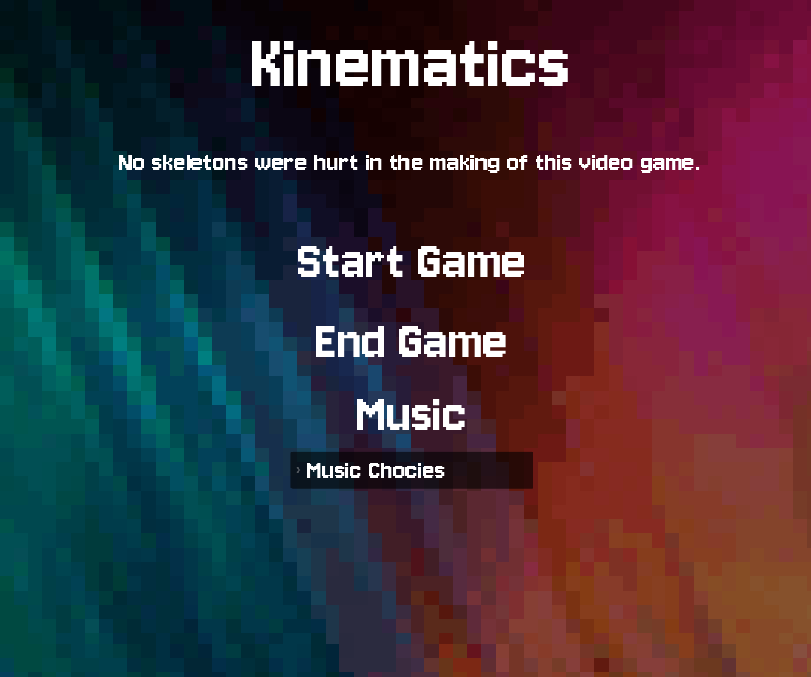
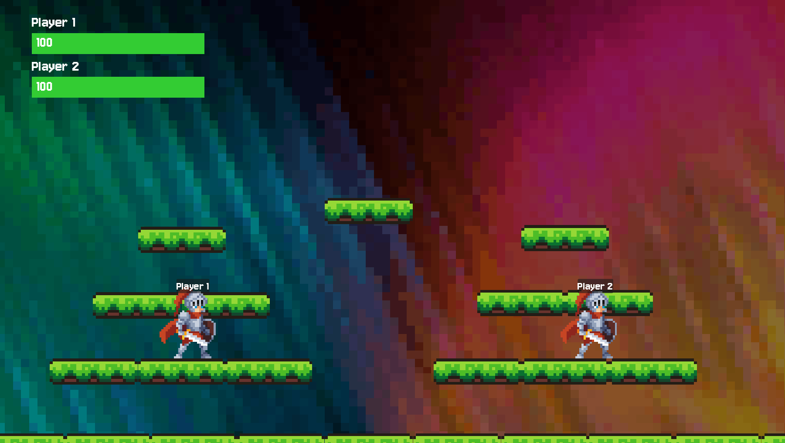

# Kinematics!

Getting too good at fighting games using your controller? or keyboard? How about trying a Xbox Kinect!
Kinematics uses the Xbox One's Kinect to take your movement and control a 2D character in a fighting area. Bring a friend and see which one of you is actually the best at fighting in a way you wouldn't have thought of...

## Requirements
* A Xbox One Kinect with PC Adapter
* Windows Operating System
* Godot Game Engine v4.x (if building from source)

## Building and Running
...

## Features

* Xbox One Kinect Tracking Server distributing UDP packets of Player Signals
* UDP Client Signaling Godot game Engine
* 2D Movement such as Jumping, Double Jumping, Attacking, and Running
* Song Tracks from our developer Zack and the famous Toby Fox!

## Moveset
The moveset for Kinematics is as follows:
* Punch left hand
* Punch right hand
* Double block both hands
* Jump (can double jump too!)
* Running left with arm pointing left
* Running right with arm pointing right

## Technical Resources
* [Microsoft .NET](https://dotnet.microsoft.com/en-us/) - Framework used for game development
* [Godot](https://godotengine.org/) - Open source game engine
* [C#](https://dotnet.microsoft.com/en-us/languages/csharp) - Programming language used for game development and client side logic
* [C++](https://en.wikipedia.org/wiki/C%2B%2B) - Programming language used for the Xbox One Kinect and server side logic
* [Xbox One Kinect SDK](https://www.microsoft.com/en-us/download/details.aspx?id=44561) - Software development kit for the Xbox One Kinect
* [itch.io](https://itch.io/) - Used for several free assets